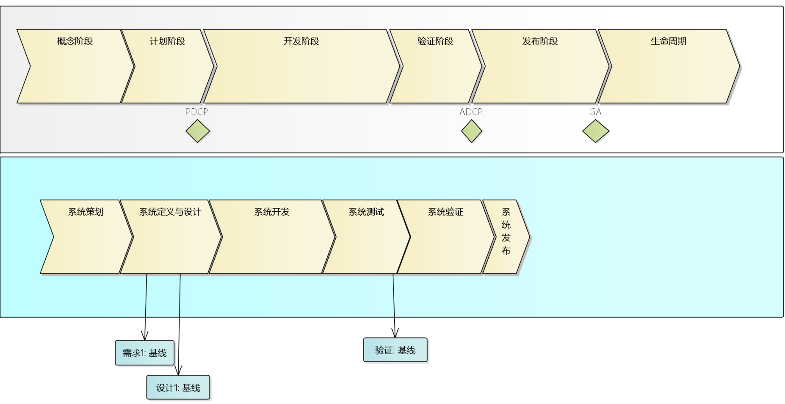

# 企业级系统开发

基于CMMI和IPD流程，从研发视角来梳理企业级系统开发的流程、角色、职责和最佳实践。

这里包括了项目管理、工程管理、支持管理和过程管理4个大方面。

* [Introduction](README.md)
* [企业级项目开发的全流程](./全流程.md)
* [项目中的角色](./项目角色.md)
* [配置管理](./配置管理.md)
  * [Gitlabflow](./gitlabflow-ci.md)
* [需求设计阶段](./需求设计.md)
  * [用例编写指南](./用例编写指南.md)
* 技术解决方案阶段
  * [系统架构设计](./TS/sys-architecture-tpl.md)
  * [组件设计](./TS/com-architecture-tpl.md)
  * [技术白皮书](./TS/technical-whitebook.md)
  * [技术决策](./TS/decision-analysis-report.md)
    * [关键技术决策示例](./TS/dar.md)
  * 研发过程管理
    * [CodeReview](./TS/codereview.md)
    * [单元测试](./TS/unit-spec.md)

