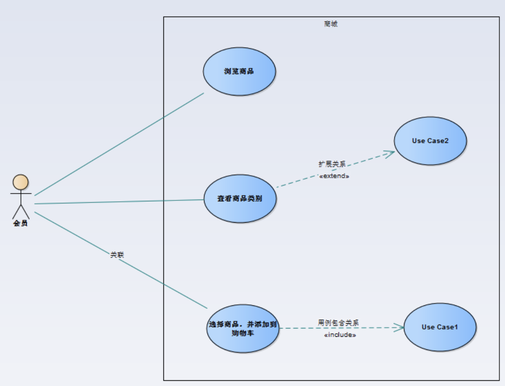
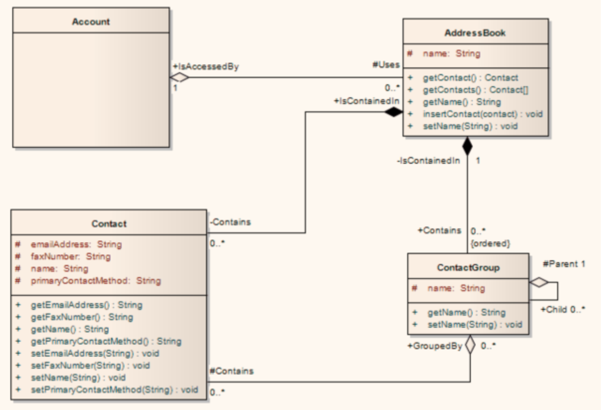
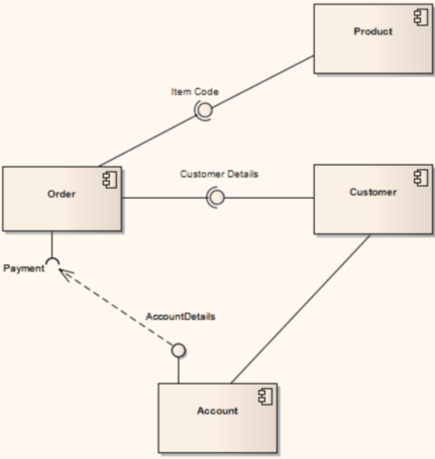
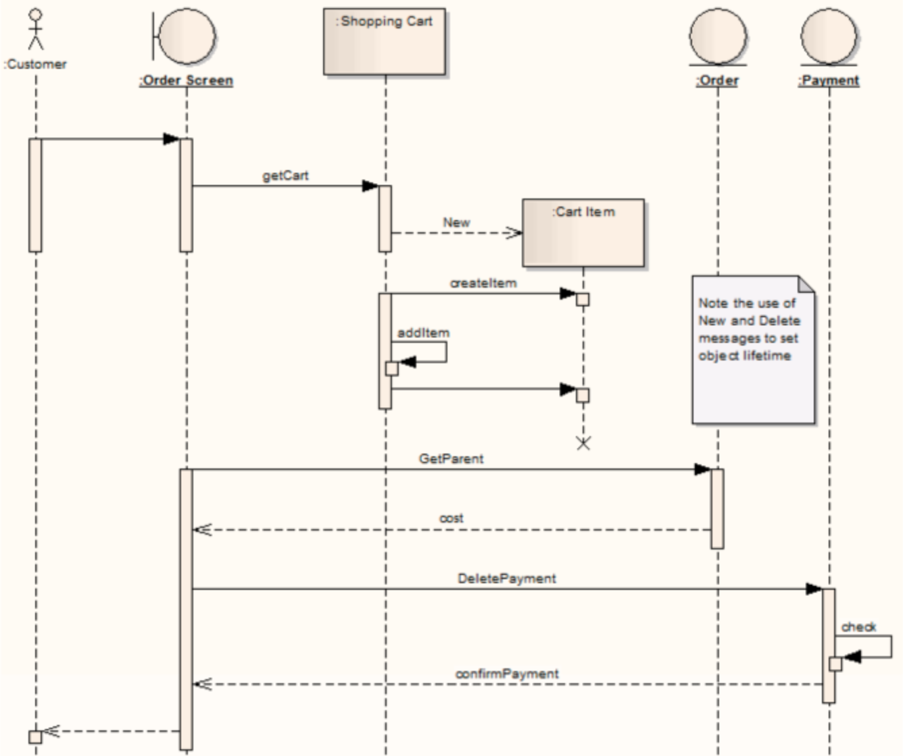
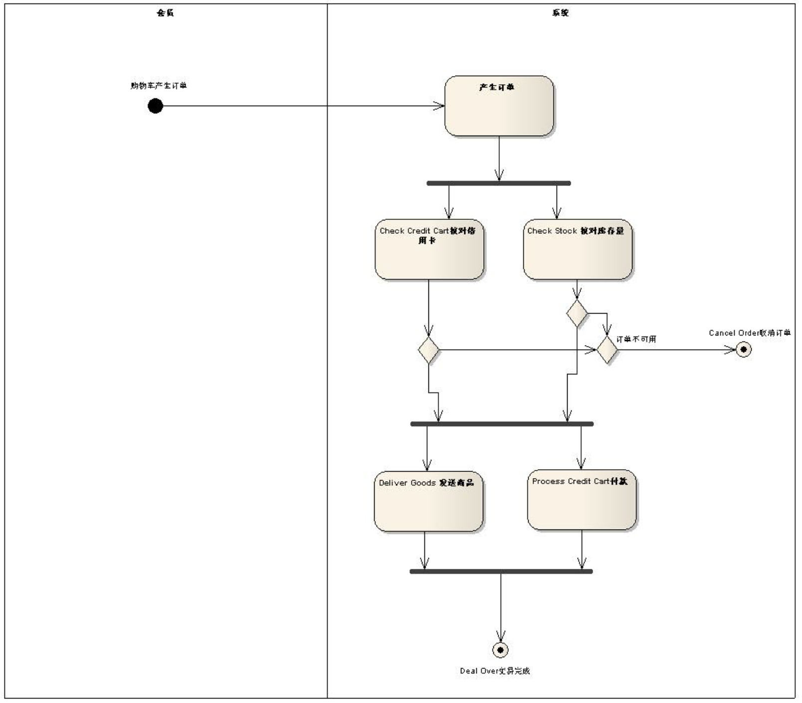

#  X项目Y组件设计说明书

## 关键用例  (用例视图 Use Case View)

> 用例图 Use Case Diagram  

## DFx需求
- 性能需求  
- 安全性需求
- 可扩展性需求
- 可维护性需求
- 可靠性需求
- 兼容性需求
- 可测试性需求
- 可管理性需求 ？
- 互操作性需求 ？

## 其他设计约束
> 例如：对开发语言约束，对数据库约束，部署约束，设备资源约束

## 领域模型设计  (逻辑视图 Logical View)  
> 类图 Class Diagram      

## 组件设计  (实现视图 Development View)
> 组件图 Component Diagram     

## 关键用例时序图 (进程视图 Process View)
> 时序图 Sequence Diagram    

> 活动图 Activity Diagram [可选]   

## 部署图  (部署视图 Deploy View)
>  部署图 Deployment Diagram    

## DFx需求实现说明

### 安全性设计
> 重点描述安全方案的考虑和设计，例如 如何防止某关键文件未被篡改；

### 性能设计
> 重点描述性能方面的考虑，例如，如何在低资源的情况下，与更多慢IO设备进行数据获取和写入。

### 可扩展性设计
> 重点描述在扩展性上的设计，例如，日志处理能力不满足场景的情况下，如何扩展。

### 可靠性设计
> 重点描述在可靠性上的设计，例如，磁盘可靠性的设计和实现 ； 服务进程异常时候的处理。

### 可维护性设计
> 重点描述在可靠性上的设计和约束，一般分为问题排查和遵从统一标准规范。  
>  例如，日志设计，如何快速定位问题；如何设计异常服务监控；  
>       遵从Restful规范，错误码规范，代码规范，目录约定，测试用例覆盖度，等等。  