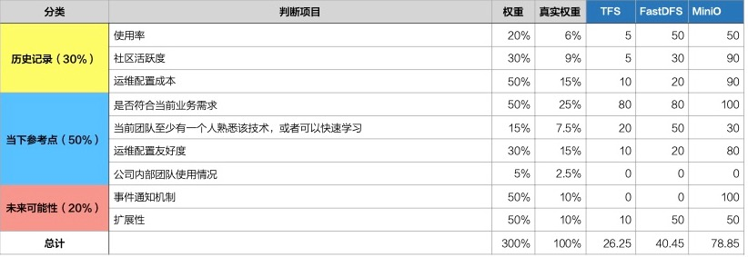

# 关于XX唯一性方案的选择

## 背景介绍

> 对要解决问题的介绍，让参与决策人快速了解背景

## 决策依据/原则

> 所有参与决策人共同讨论出本次决策依据和原则

|依据|原则|
|--|--|
|目标是什么？| 1. 提供一个通用的设备唯一标识   2. 适配所有的安全设备 |
|可参考什么？| 1. AWS EC2管理   2. ODL中的设备管理   3. 浏览器指纹方案 |
|不能允许出现什么？| 1. 同一个设备在不同时间有不同的唯一标识    2. 同一个设备在删除后重新添加唯一标识变化   3. 多个设备同一个标识 |
|什么不是关键要素？| 1. 唯一标识的可读性 |

## 可行方案说明

### 解决方案一

调整`irp-device-task`模块和`irp-device`模块之间设备信息交互逻辑，`irp-device`模块对于`irp-device-task`模块自发现任务上报的设备列表，采用管理`IP`进行唯一性校验，步骤如下：

- 忽略管理`IP`与已管理设备的管理`IP`相同的设备
- 过滤出管理IP在自发现设备中已存在的设备，进行更新
- 录入新出现的管理`IP`对应的自发现设备

### 解决方案二

调整`irp-topology`模块更新节点逻辑，步骤如下：

- 调整管理`IP`作为节点的唯一标识，需要进行节点数据结构的重构
- 节点新增设备唯一标识列表属性，记录管理`IP`相同的设备唯一标识

调整`irp-intention`模块解析路径逻辑，步骤如下：

- 遍历路径中所有节点唯一标识，查询节点信息，获取设备唯一标识列表
- 根据设备唯一标识分析和调整安全策略

## 决策

> 建议采用决策评分表来进行决策

### 决策结论

最终决策：**选择方案一**

从模块定义上考虑，设备唯一性校验由`irp-device`模块来维护较为合理，对于其他使用设备信息的模块来说，可以不用关心设备唯一性的逻辑；

方案二较方案一改动量较大

## 后续效果

> 持续更新决策后带来影响和效果

1. 在xxx1号项目中实验完毕，并完成实施。
2. 在xxx2号项目中解决在设备管理的领域中的设备唯一性标识问题
3. ......
