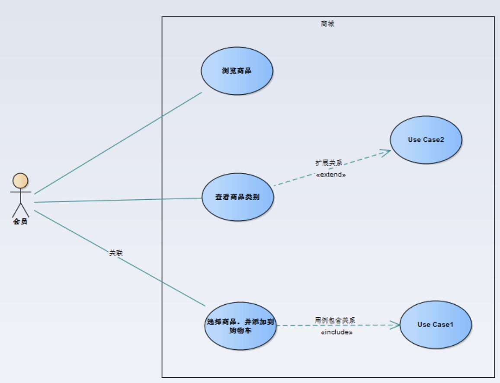
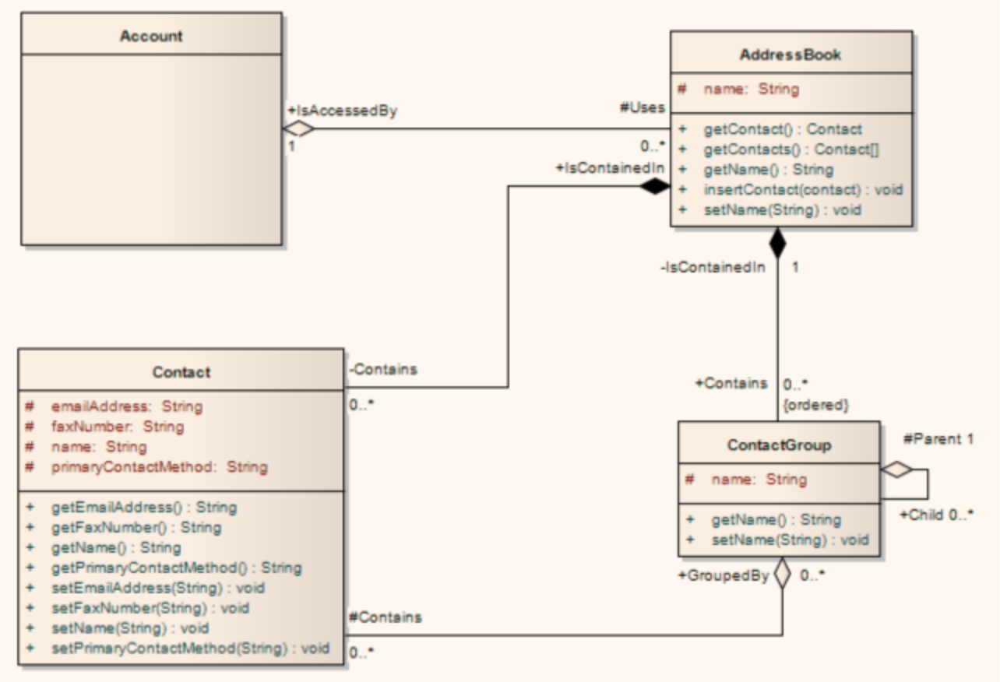
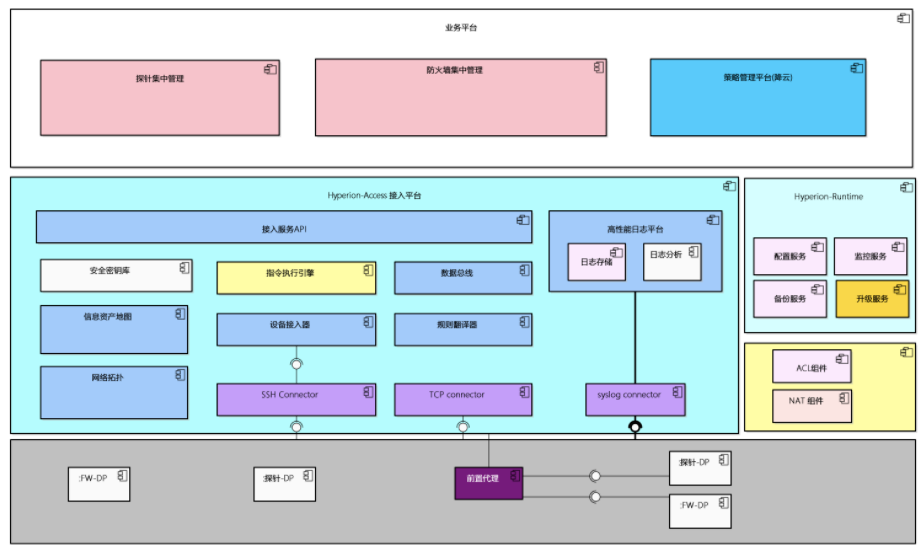
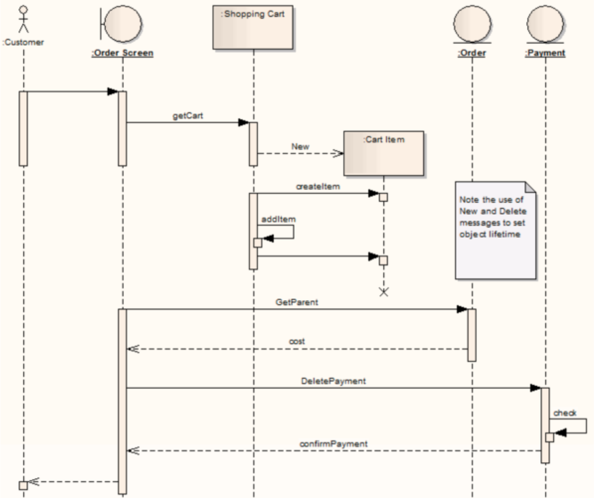
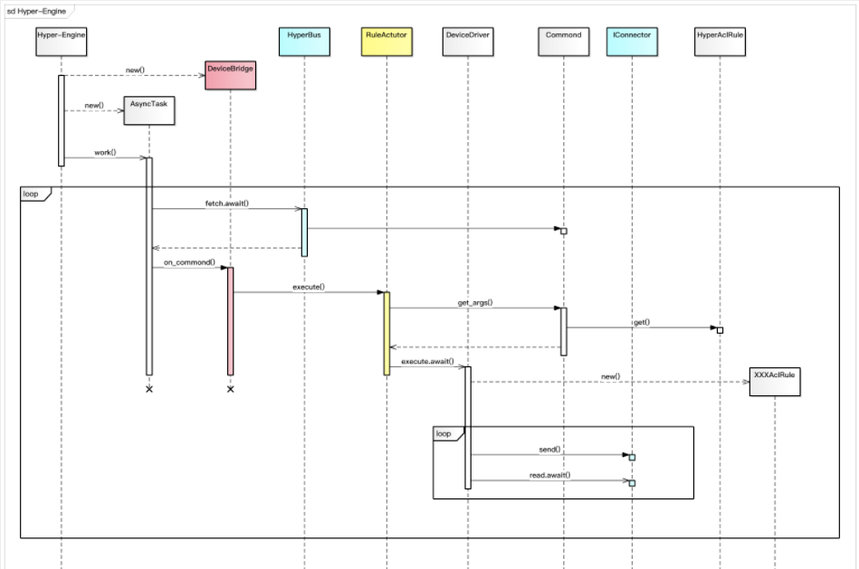
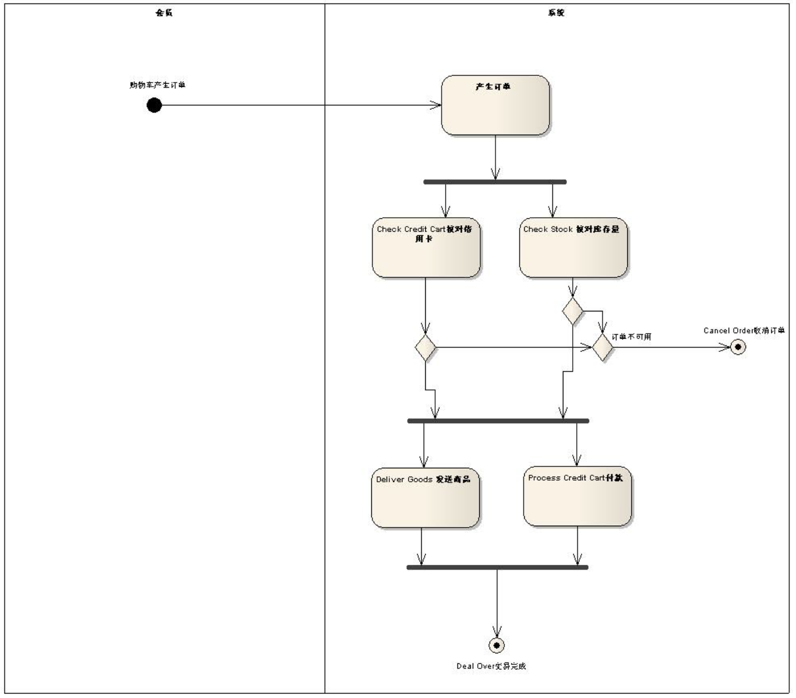
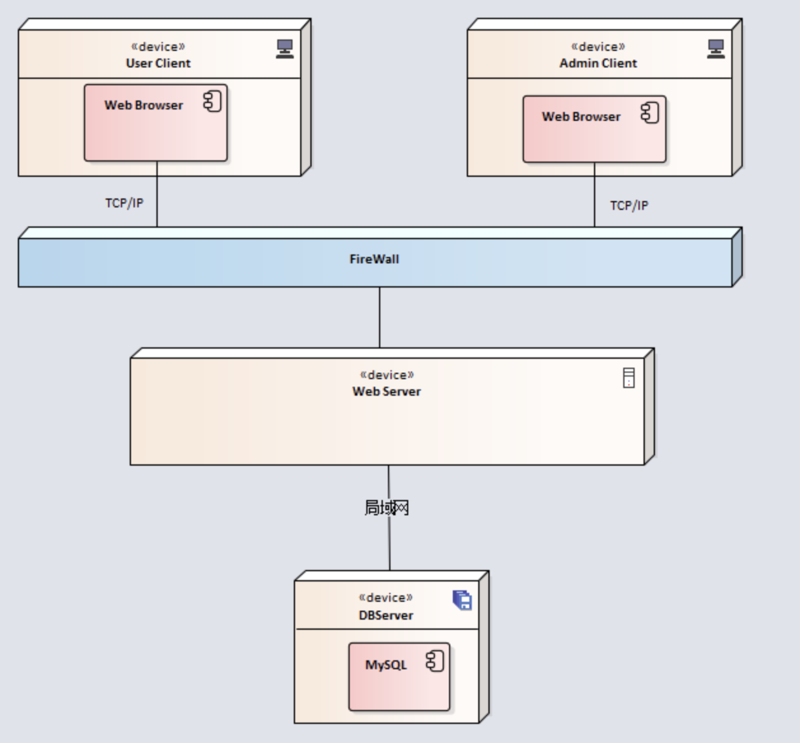
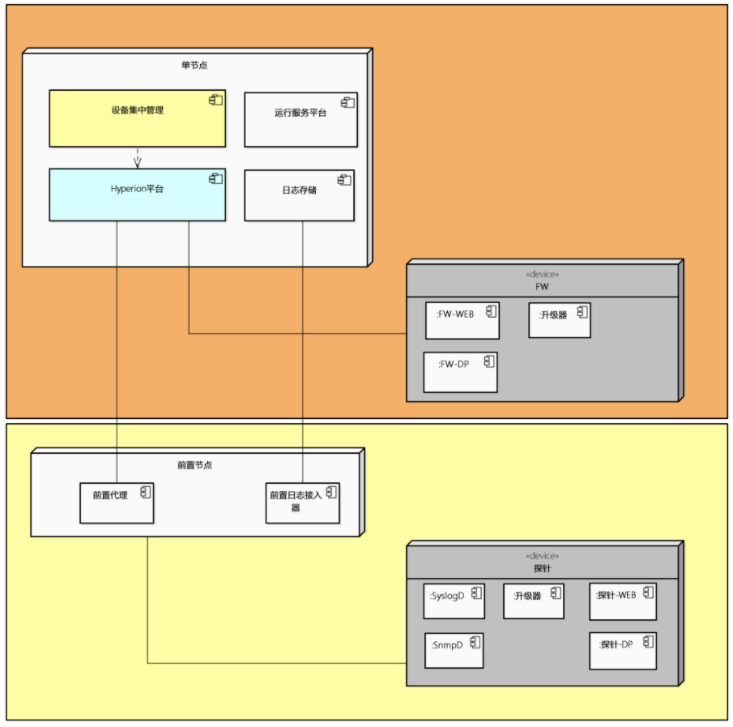

#   XX项目架构设计说明书

>**编写说明:**
>
>* 系统架构说明书，不要求文档格式,但要易于被管理、它是项目的核心资料 ;
>* 架构的图示，请使用UML表达，这是软件开发领域的主流建模语言
>* 此文档在过程指导系统开发，并可以导出系统的《技术白皮书》
>* 不存在的章节，可以删除 ;

## 1. 系统设计的目的

### 主要业务问题

*影响系统架构的关键业务问题,在此简要说明。后续系统设计都是围绕解决此问而开展的。*

## 2. 技术决策

> 列出所有的技术决策及连接

> 例如：消息队列组件选用Kafka 决策文档

## 3. 关键用例  (用例视图 Use Case View)  

> 用例图 Use Case Diagram  

## 4. DFX需求

### 性能需求：

> 流量解析： 100M /S

### 安全性需求 (军: 安全性)

> 安全性是设计的底线，系统运行期间不能造成重大的人员、设备、环境、经济事故等。
>  
> 安全性设计是需要再增加一些约束，当所有约束条件都满足，才能使系统工作。如传输加密、数据加密、系统脱敏等

### 可服务性需求(军:可保障性）

> 保障性是要解决系统坏了，现场可以修、能够及时修的问题。
>  
> 如：异常机制

### 可维修性（军：可维修性）

> 维修性是要解决坏了怎么办的问题
>  
> 设计时应考虑系统的可分解性，能将系统有效的分解到最小可承受损失的组成部分，对于坏了的部分进行替换维修
>  
> 如系统崩溃后，10分钟内重装和恢复系统完成

### 可靠性需求(军：可靠性)

> 产品每个组成部分的材料，如选用质量等级高的元器件、原材料等，如选用工业级、军温级、“七专”、883级、宇航级等元器件、选用稀有金属、碳纤维等材料
>  
> 可靠性设计，如串联、冗余、双机热备份、“三中取二”判决器等
>  
> 系统降额设计，系统设计应该留有余量，如设计按照50%降额以下设计
>  
> 系统可用性 99.99%

### 可扩展性需求

> 通过添加同配置服务器，性能处理能力 提升 50%

### 可测试性需求 (军)

> 系统运行期间，我们要及时掌握系统的运行状况，以便一旦出现问题，可以采取必要措施，避免重大损失。
>  
> 如： 控制面板（终端）、调试窗口等

### 环境适应性需求(军)

> 软件在不同计算资源运行适应能力
>  
> 可以采用“抗”和“保”的措施，“抗”是提高系统自身的能力，“保”是为系统增加一些保护措施，如设计加温、降温、防水、防磁…等外壳，将系统保护起来。

## 其他设计约束

> 例如：对开发语言约束，对数据库约束，部署约束，设备资源约束

> 例如：当前团队程序只熟悉PHP，整个项目需要在1个月之内完成

## 5. 领域模型设计  (逻辑视图 Logical View)  

> 类图 Class Diagram      

## 系统分层和组件结构设计

> 分层设计图 & 组件说明  

## 关键用例时序图 (进程视图 Process View)

> 时序图 Sequence Diagram

> 活动图 Activity Diagram [可选]

## 部署图  (部署视图 Deploy View)

>  部署图 Deployment Diagram

## 6. DFX需求实现说明

### 安全性设计

> 重点描述安全方案的考虑和设计，例如 如何防止某关键文件未被篡改；

### 性能设计

> 重点描述性能方面的考虑，例如，如何在低资源的情况下，与更多慢IO设备进行数据获取和写入。

### 可扩展性设计

> 重点描述在扩展性上的设计，例如，日志处理能力不满足场景的情况下，如何扩展。

### 可靠性设计

> 重点描述在可靠性上的设计，例如，磁盘可靠性的设计和实现 ； 服务进程异常时候的处理。

### 可维护性设计

> 重点描述在可靠性上的设计和约束，一般分为问题排查和遵从统一标准规范。  
>  例如，日志设计，如何快速定位问题；如何设计异常服务监控；  
>       遵从Restful规范，错误码规范，代码规范，目录约定，测试用例覆盖度，等等。  

