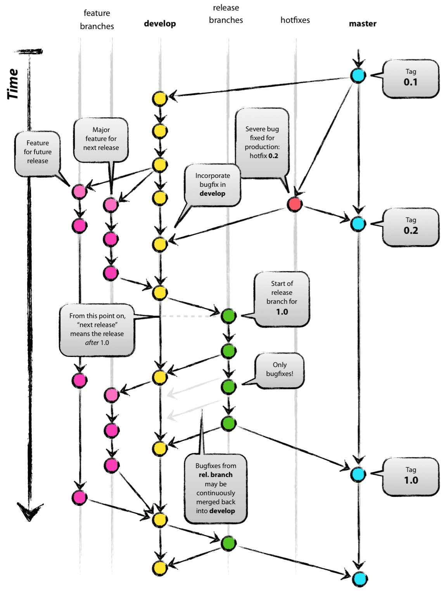
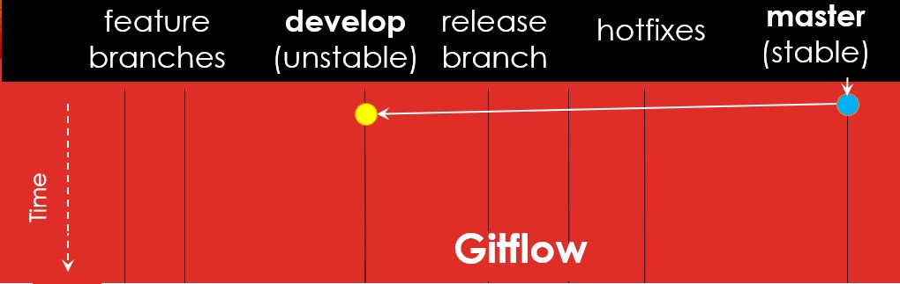
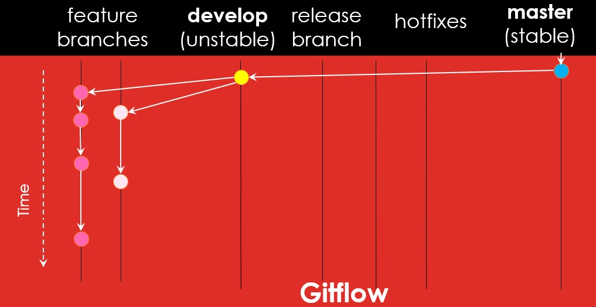
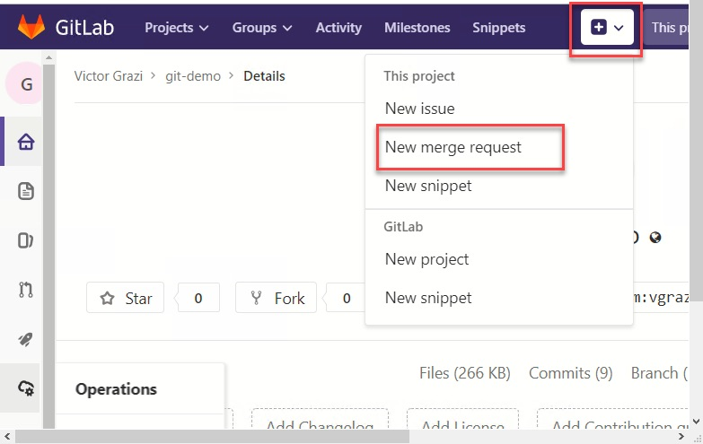
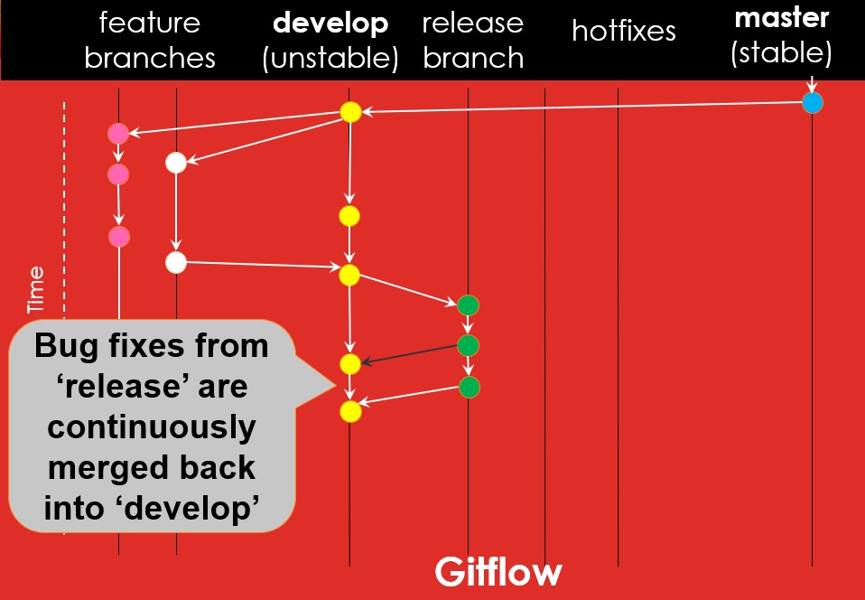
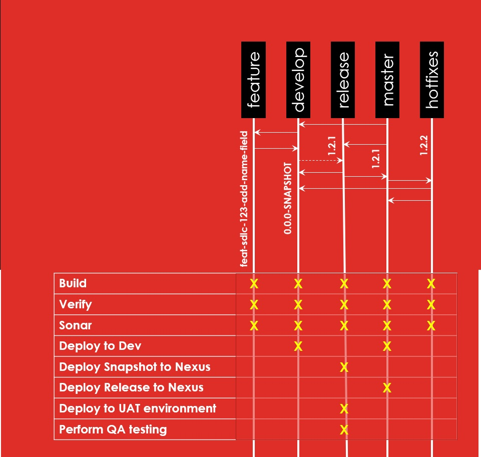

# 基于GitLab Flow的持续集成示例

- [基于GitLab Flow的持续集成示例](#%e5%9f%ba%e4%ba%8egitlab-flow%e7%9a%84%e6%8c%81%e7%bb%ad%e9%9b%86%e6%88%90%e7%a4%ba%e4%be%8b)
  - [前言](#%e5%89%8d%e8%a8%80)
  - [谈谈 GitLab Flow](#%e8%b0%88%e8%b0%88-gitlab-flow)
  - [开始 Gitflow](#%e5%bc%80%e5%a7%8b-gitflow)
  - [GitLab CI](#gitlab-ci)
  - [测试覆盖率](#%e6%b5%8b%e8%af%95%e8%a6%86%e7%9b%96%e7%8e%87)
  - [集成工作](#%e9%9b%86%e6%88%90%e5%b7%a5%e4%bd%9c)
  - [配置 GitLab CI](#%e9%85%8d%e7%bd%ae-gitlab-ci)
  - [Fix Bugs](#fix-bugs)
  - [发布](#%e5%8f%91%e5%b8%83)
  - [Hotfixes](#hotfixes)
  - [总结](#%e6%80%bb%e7%bb%93)
  - [后记](#%e5%90%8e%e8%ae%b0)

## 前言

过去开发者花上几周或几个月开发完一个应用功能之后，他们需要进行合并代码的工作。这时候需要有专人，也许是版本管理员，把所有的新功能集成起来，解决代码冲突、然后准备发布新的版本。代码的合并总是让人担惊受怕，毕竟会伴随着不可预见的错误，这可能让我们一个挺好的应用变成了「集成地狱」。在 2000 年的时候，`Kent Beck`发布了具有开创性的著作[《Extreme Programming Explained》](https://www.amazon.com/Extreme-Programming-Explained-Embrace-Change/dp/0321278658)，其中提出了「[持续集成](http://www.extremeprogramming.org/rules/integrateoften.html)」的概念，即开发人员需要每几个小时或最多一天内进行编译然后合并代码到主分支最后再运行自动化测试。

说明：本文的项目是使用 `Java` 和 `Maven`，使用 `GitLab CI` 来执行脚本（`Jenkins` 和 `GitHub CI plugin` 也同样支持）。使用 `Jira` 来跟踪问题单，`IntelliJ IDEA` 作为 `IDE`，`Artifactory` 作为仓库管理，`Ansible` 作为自动化部署工具。

## 谈谈 GitLab Flow

[GitLab Flow](https://docs.gitlab.com/ee/workflow/gitlab_flow.html)提倡使用[feature branches](https://martinfowler.com/bliki/FeatureBranch.html)模式来开发各个相互独立的功能，同时分成不同的分支以便进行集成和发布，如下图：



作为`Git`使用者，我们应该对`master`分支已经不陌生了，它是`Git`初始化项目的时候默认创建的分支，是项目的主干。在使用`Gitflow`模式之前，你很可能会直接提交代码到`master`分支上。

## 开始 Gitflow

开始使用 Gitflow 之前，需要做一步一次性的初始化动作，就是从 master 分支上创建一个 develop 分支。自此，develop 分支将变成一个类似全能的分支，用来存放、测试所有的代码，同时也是主要是用来合并代码、集成功能的分支。



作为一个开发人员，在这是不允许直接提交代码到 `develop` 分支上的，更更更不允许直接提交到 `master` 分支。`master` 分支代表的是一个「`stable`」的分支，包含的是已投产或即将投产的代码。如果一段代码在 `master` 分支上，即代表它已经投产或即将投产发布。

develop 分支代表着「`unstable`」，它包含了需要编译并且需要测试通过的代码，甚至是没有完成的代码，所以称之为「`unstable`」。

接下来将介绍我们是如何开展工作的：

比如，当你被派到了一个`Jira`问题单，你需要立即从 `delevop` 分支上创建一个`feature`分支。



在`feature`分支的命名规则上，我们约定以「`feat/`」开头，后面跟上问题单编号。如「`feat/CMMI-123/add-gitflow`」。以「`feat/`」开头，可以让 `CI` 服务器识别出这是一个`feature` 分支，「`CMMI-123`」是我们 `Jira` 问题单的编号，可以链接到问题单，剩下的部分则是对该功能的简短的说明。

这样，我们的开发工作就可以并行地开展，每个人都可以同时在各自的`feature`分支上开发，当我们持续的将功能`merge`到`develop`分支上后，我们可以大大减少变成「集成地狱」的可能。

## GitLab CI

现在我们让团队更频繁的提交代码，那么，我们是怎么避免冲突呢？答案是使用`GitLab CI`来进行`build`，我们将`GitLab CI`绑定到以「`feat/`」开头命名的分支即`feature`分支，在`feature`分支上执行`Maven verify`（本地编译以及运行`tests`），但不发布到`Artifactory`仓库。

`GitLab CI`是通过项目根目录里的`.gitlab-ci.yml`文件进行配置，包含了`CI/CD`的各个步骤。这个功能的绝妙之处是它可以将运行脚本和代码提交进行绑定。

如下是`GitLab CI`的配置例子，其中我们通过正则表达式来绑定了`feature`分支：

```yml
feature-build:
  stage: 
    build
  script:
    - mvn clean verify sonar:sonar
  only:
    - /^feat//\w+$/
```

团队提倡频繁地提交代码，每次提交代码都会独立的运行`tests`，以保证当前提交的代码不会影响到项目原有的任何其它功能。

## 测试覆盖率

接下来我们该讨论测试覆盖率，`IntelliJ idea`自带`coverage`运行模式，允许运行测试代码检查测试覆盖率，会通过侧边栏粉色或绿色来标记是否被测试代码覆盖到。同时建议在`Maven`里添加测试覆盖率插件，如 `jacoco`，它可以在 `GitLab CI` 运行集成编译的时候生成报告。

`Maven`的`test`阶段执行单元测试，`verify`阶段执行集成测试。建议安装`SonarQube`和 `Maven SonarQube`插件来进行静态代码的分析和测试。这样，每一个`feature`分支的每一次提交都会执行上述所有的`test`。

## 集成工作

回到`Gitflow`，现在我们已经开发完了新功能，同时将代码提交到了`feature`分支，根据「持续集成」到思想，我们**要求开发团队需要频繁地把代码从`feature`分支`merge`到`develop`分支上，要求频率最晚不超过一天**。

同时`GitLab`里内置了一个代码复查的机制，即发起一个`merge`请求后，我们必须复查完代码才可以将代码`merge`到`develop`分支上。



根据不同的`SDLC`(软件开发生命周期）要求，比如我们强制不同的且具有相关职责的开发人员进行代码复查，或者可以更简单点，开发人员自己复查自己的代码，这样起码鼓励了开发人员可以至少复查一下自己的代码，当然也很明显的增加了很多不靠谱的风险。

最终，经过几天的努力，项目功能已经开发完毕，而且已经全部`merge`到`develop`分支上，并验证完毕，同时，其它几个功能也开发完毕也准备发布。记住此时我们只是在每一次的提交时进行了验证，并没有进行部署，如发布`SNAPSHOT`版本到`Artifactory`仓库上，这是我们下一步将要做的。

此时，我们在`develop`分支上新建一个`release`分支，然而与传统的`Gitflow`不同，新建的`release`分支是以版本号来命名，版本号命名规则可参考[这里](https://semver.org/lang/zh-CN/)。如果`SNAPSHOT`版本的版本号是`1.2.1-SNAPSHOT`，那么此次的`release`分支应该命名为`1.2.1`。

## 配置 GitLab CI

配置[GitLab CI](https://about.gitlab.com/product/continuous-integration/)使用正则表达式来识别一个`release`分支，同时执行相关的脚本。

```yml
release-build:
  stage:
    build
  script: 
    - mvn versions:set -DnewVersion=${CI_COMMIT_REF_NAME}-SNAPSHOT
    # now commit the version to the release branch
    - git add .
    - git commit -m "create snapshot [ci skip]"
    - git push
    # Deploy the binary to Nexus:
    - mvn deploy
  only:
    - /^\d+\.\d+\.\d+$/
  except:
    - tags
```

主要特别注意的是提交的时候需要加上`[ci skip]`防止新的提交再次触发`GitLab CI`，从而进入死循环。

## Fix Bugs

在测试中，难免发现`bug`，我们可以直接在`release`分支上修改，修改完后再`merge`到 `develop`分支上（`develop`分支包含的是已发布或者即将发布的代码）。



## 发布

最后，`release`分支被验证通过，我们将会把它`merge`到`master`分支中。合并时，`release分支中的版本号还是`SNAPSHOT`版本，`GitLab runner`会通过`Maven`版本插件将版本号后缀`SNAPSHOT`去掉，同时生成下一个`SNAPSHOT`版本号并发布到`Artifacotory`。此时还会将其部署到预发布环境中进行测试，测试无问题后再部署到生产环境。

相关的 CI 配置如下：

```yml
master-branch-build:
  stage:
    build
  script:
    # Remove the -SNAPSHOT from the POM version
    - mvn versions:set -DremoveSnapshot
    # use the Maven help plugin to determine the version. Note the grep -v at the end, to prune out unwanted log lines.
    - export FINAL_VERSION=$(mvn --non-recursive help:evaluate -Dexpression=project.version | grep -v '\[.*')
    # Stage and commit the binaries (again using [ci skip] in the comment to avoid cycles)
    - git add .
    - git commit -m "Create release version [ci skip]"
    # Tag the release
    - git tag -a ${FINAL_VERSION} -m "Create release version"
    - git push 
    - mvn sonar:sonar deploy
  artifacts:
    paths:
    # list our binaries here for Ansible deployment in the master-branch-deploy stage
    - target/my-binaries-*.jar
  only:
    - master
 
master-branch-deploy:
  stage:
    deploy
  dependencies:
    - master-branch-build
  script:
   # "We would deploy artifacts (target/my-binaries-*.jar) here, using ansible
  only:
    - master
```

## Hotfixes

还有一个必须说明的分支是`hotfixes`分支。这个分支是负责在生产环境上发现的问题，如`bug`或者性能问题等。 `hotfixes`分支和`release`分支类似，都以`release`版本号命名，唯一的区别就是`hotfixes`是新建于`master`分支，`release`分支则是从`develop`分支而来。

`hotfix`就是这样，和`release`一样，都会触发`Artifactory` `SNAPSHOT`发布，然后部署到预发布环境。当一切都没问题验证通过后，需要再将它`merge`回`develop`分支，然后再 `merge`到`master`以进行投产发布。

## 总结

总结图表如下：



以上就是`Gitflow`的特点，我们建议大家积极尝试文中所说的各种方法，可以带来如下一些优势：

- 功能相互隔离。开发人员可以独立的变更功能，使得团队集成工作更加轻松，或者代码的合并加频繁。
- 功能相互独立，在每个发布的新版本中可以挑选想要发布的功能，同时可以支持我们持续发布新的功能。
- 更多、更合规的代码复查工作。
- 自动化测试、部署和交付到各个环境。

## 后记

现在业界都在讨论「持续交付」，如果你的团队每天都会发布很多版本，本文的方法估计不太适合你，**如果你所在的是一个传统企业，如一些金融机构，在版本发布方面更加谨慎，那本文所介绍的分支管理、持续集成、自动化测试以及自动化部署等方面内容也许对你有所帮助**。
