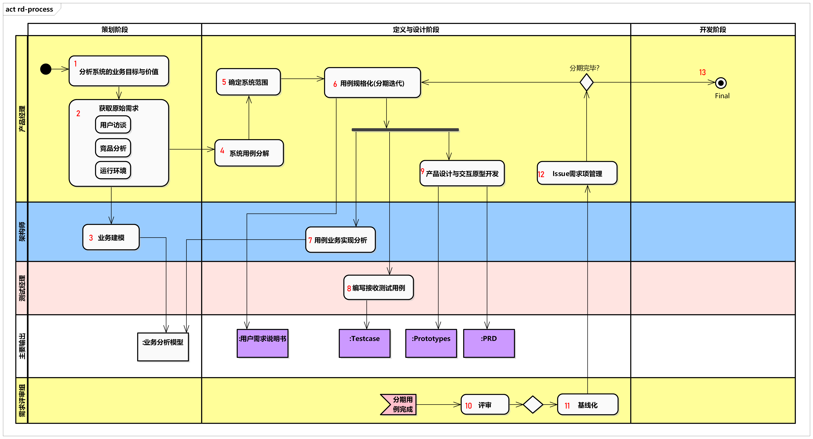

# 需求设计

### 

#### (1)  分析系统业务价值与业务目标

需要清晰明确所开发的系统解决的什么样的业务问题，体现的怎样的业务价值及系统的业务目标。 输出到　PRD文档

#### (2)获取原始需求

##### 用户访谈：

对于构建的系统的使用者进行访谈，明确系统可以解决他什么样的问题，使用场景的整理和使用的约束

##### 竞品分析：

**【可选】**

##### 运行环境：

确定目标系统所运行的环境，包括：

*   所在的网络结构 
*   需要的计算资源
*   网络带宽
*   软件环境

#### (3) 业务建模

为客户建立业务模型，用于验检客户需求的合理性，补充遗漏的需求。 业务模型包括：

* 客户的主要业务流
* 主要业务概念及关系
* 客户的主要组织结构和职责

#### (4) 系统用例分解

根据系统的使用角色(Actor) 分解整理出可能存在的用例，以达到系统的目标。 用例分解应使用例模型进行，它包括：

*   系统的使用角色
*   用例( 层次)

#### (5) 确定系统支持的范围

通过用例确定系统支持的范围。

#### (6) 用例规格化

在确定用例的目标后，整理出用例下的场景（包括正确场景和异常场景）

在场景中要描述：

*   前置条件
*   后置条件
*   输入信息
*   输出信息
*   业务规则

**用例规格化，是需求明确清晰的关键，它作为后续研发活动的主要输入**

#### (7) 业务分析用例实现

通过业务实体、角色来实现用例，以理解业务元素如何协作、达成业务目标。

#### (8) 设计系统交互原型

产品经理通过原型的设计来实现用例目标。

#### (9) 设计系统测试用例

编写测试用例是对于用例的的验证，用于对于用例规格的评测试执行的依据

#### (10）评审：

*   目标：
    *   系统的业务目标和价值是否清晰
    *   是否具备所需要的DFX需求，包括（安全需求等）
    *   系统的用例范围和边界（做什么，不做什么）
    *   规格化用例的标准性和清晰性
    *   交互原型是否符合人性化操作、场景是否易于准确理解
*   评审负责人： 系统的负责人
*   评审人： 架构师、测试代表、QA、产品代表、交付代表、安全代表、开发代表、客户代表

#### （11） 基线化

通过评审后，安排配置管理计划进行基线化。

###  

### 交付物输出

* 用户需求说明书

* 产品需求说明书(PRD)
* 需求对接单
* 交互原型
* 业务分析文档/模型  【可选】
* 接收测试用例